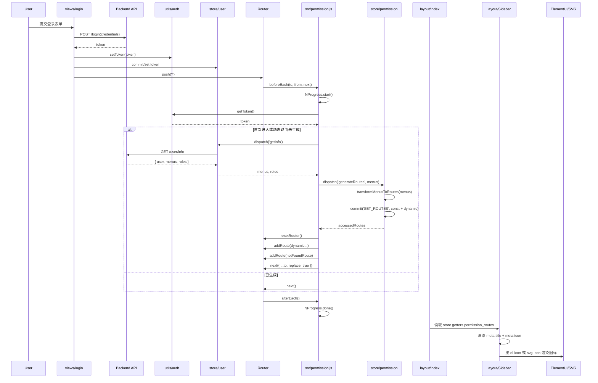

# 登录后整体流程与侧边栏渲染时序

本文档梳理了“登录后的全部动作”以及“侧边栏渲染”的关键路径，便于排查菜单标题/图标不显示、动态路由未注入等问题。

---

## 一、整体流程（概览）
- 用户在登录页提交表单，登录成功后将 token 写入本地（utils/auth）与 Vuex（store/user）。
- 导航到受保护页面时，路由前置守卫（src/permission.js）启动 NProgress，校验 token，若未生成动态路由则：拉取用户信息 -> 基于后端菜单生成前端动态路由 -> 重置并注入路由 -> 以 replace 方式重试当前路由。
- 路由放行后，后置守卫关闭 NProgress。
- 布局渲染时，侧边栏从 store.getters.permission_routes 读取“常量路由 + 动态路由”并渲染，菜单项使用 route.meta.title 与 route.meta.icon 显示标题与图标。

---

## 二、核心参与者与职责
- 登录页（src/views/login）：发起登录、持久化 token。
- utils/auth（src/utils/auth.js）：读写 token 到 Cookie/LocalStorage。
- 路由（src/router/index.js）：初始化 constantRoutes，提供 resetRouter，导出 notFoundRoute。
- 权限守卫（src/permission.js）：导航拦截、拉取用户信息、动态路由注入、NProgress 控制。
- 用户模块（src/store/modules/user.js）：登录、获取用户信息（含 menus/roles）、存储用户态。
- 权限模块（src/store/modules/permission.js）：把后端菜单转为前端路由并存入 Vuex，供侧边栏渲染。
- 侧边栏（src/layout/components/Sidebar）：从 Vuex 获取 permission_routes 并渲染树形菜单。

---

## 三、详细步骤（含关键数据点）
1) 登录成功：
- user/login：拿到 token -> utils/auth.setToken 写入 -> Vuex user.state 更新。
- router.push('/') 触发后续导航。

2) 路由前置守卫 beforeEach（src/permission.js）：
- NProgress.start()
- 有 token -> 判断 permission.generated：
  - 未生成：
    - dispatch user/getInfo：得到用户信息、menus、roles。
    - dispatch permission/generateRoutes(menus)：
      - transformMenusToRoutes：处理 component 路径、Layout、meta.title/icon/roles 等映射。
      - commit SET_ROUTES：state.routes = constantRoutes + 动态路由。
    - resetRouter()；逐个 addRoute(动态路由)；addRoute(notFoundRoute)。
    - next({ ...to, replace: true }) 继续原目标，避免重复历史记录。
  - 已生成：
    - 直接 next() 放行。

3) 路由后置守卫 afterEach：
- NProgress.done()

4) 布局与侧边栏渲染：
- Sidebar 计算属性 routes = store.getters.permission_routes（为空时回退 router.options.routes）。
- SidebarItem/Item 渲染：
  - 标题：来自 route.meta.title。
  - 图标：
    - 若 meta.icon 包含 "el-icon"，使用 <i class="el-icon-xxx"> 类名渲染（Element UI 图标）。
    - 否则按自定义 SVG 名称交给 <svg-icon icon-class="xxx" /> 渲染（需在 src/icons/svg 下存在同名 svg）。

---

## 四、Mermaid 时序图

---

## 五、排查建议（常见问题定位）
- 动态路由是否已注入：刷新后在 Vue DevTools 检查 state.permission.routes 是否包含期望菜单。
- 标题/图标映射是否正确：确认后端字段是否被 buildMeta 兼容到 meta.title、meta.icon；必要时补充字段映射。
- 图标不显示：
  - 如果后端返回 el-icon- 前缀类名，应能直接渲染 Element UI 图标。
  - 如果返回自定义名（非 el-icon-），需在 src/icons/svg 下存在同名 svg 文件。
- 后端菜单有变更后请刷新或重新登录，触发重新生成动态路由。